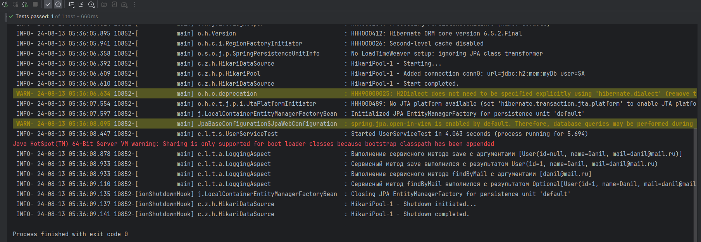

T1 AOP Practice

Данное приложение представляет собой демонстрацию полученных навыков в Аспектно ориентированном
программировании

Представлен следующий функционал:

Логирование сервисных методов

Валидация параметров сервисных методов:
@Size(max, min)
@Mail(reg)

@Size представляет собой аннотацию для валидации размера строк, реализующих интерфейс CharSequence
- max отвечает за максимальный размер строки (тип int)
- min отвечает за минимальный размер строки (тип int)

@Mail представляет собой аннотацию для валидации майла
- reg представляет собой регулярное выражение (тип String)

Демонстрация аспекта для логирования представлена на следующем скрине:
